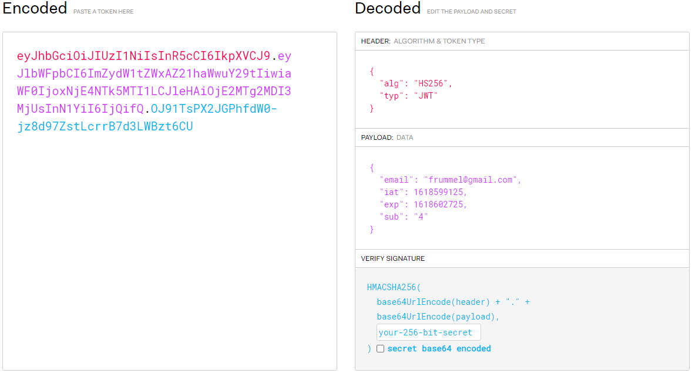

## Routing

Maak de volgende pagina's met routing:
- Een homepagina (url: /)
- Een profielpagina: (url: /profile)
- Een registreerpagina (url: /sign-up)
- Een login pagina (url: /sign-in)

<i>map pages > Home.js</i>
    
    import React from 'react';
    import { Link } from 'react-router-dom';
    
    function Home() {
        return (
            <>
              <h1>Homepagina</h1>
              
Lorem ipsum dolor sit amet, consectetur adipisicing elit. Ab alias cum debitis dolor dolore fuga id molestias qui quo unde?

              
Als je ingelogd bent, bekijk dan de <Link to="/profile">Profielpagina</Link>

              
Je kunt ook <Link to="/signin">inloggen</Link> of jezelf <Link to="/signup">registeren</Link> als je nog geen account hebt.

            </>
        );
    }
    
    export default Home;

<i>map pages > Profile.js</i>

    import React from 'react';
    import { Link } from 'react-router-dom';
    
    function Profile() {
        return (
            <>
                <h1>Profielpagina</h1>
                <h2>Gegevens</h2>
                
<strong>Gebruikersnaam:</strong> intoyou

                
<strong>Email:</strong> intoyou@gmail.com

                <h2>Afgeschermde content voor ingelogde gebruikers</h2>
                
Lorem ipsum dolor sit amet, consectetur adipisicing elit. Ab alias cum debitis dolor dolore fuga id molestias qui quo unde?

                
Terug naar de <Link to="/">Homepagina</Link>

            </>
        );
    }
    
    export default Profile;

<i>map pages > SignIn.js</i>

    import React from 'react';
    
    function SignIn() {
            
        return (
            <>
                <h1>Inloggen</h1>
                
Lorem ipsum dolor sit amet, consectetur adipisicing elit. Ab alias cum debitis dolor dolore fuga id molestias qui quo unde?
                        
            </>
        );
    }
    
    export default SignIn;

<i>map pages > SignUp.js</i>

    import React from 'react';
    
    function SignUp() {
    
        return (
            <>
                <h1>Registreren</h1>
                
Lorem ipsum dolor sit amet, consectetur adipisicing elit. Ab alias cum debitis dolor dolore fuga id molestias qui quo unde?

            </>
        );
    }

    export default SignUp;    

<i>App.js</i>

    import React from 'react';
    import { Switch, Route } from 'react-router-dom';
    import Header from './components/Header';
    import Profile from './pages/Profile';
    import Home from './pages/Home';
    import SignIn from './pages/SignIn';
    import SignUp from './pages/SignUp';
    import './App.css';

    function App() {
        return (
            <>
                <Header />
                

                    <Switch>
                        <Route exact path="/">
                          <Home />
                        </Route>
                        <Route path="/profile">
                          <Profile />
                        </Route>
                        <Route exact path="/signin">
                          <SignIn />
                        </Route>
                        <Route exact path="/signup">
                          <SignUp />
                        </Route>
                    </Switch>
                

            </>
        );
    }
    
    export default App;

## React-hook-form

Maak met react-hook-form een inlog formulier (alleen gebruikersnaam en wachtwoord) op de inlog pagina en een registreer-formulier (gebruikersnaam, email en wachtwoord) op de registreerpagina. Deze formulieren loggen de ingevulde waardes in de console wanneer de gebruiker op submit drukt.

<i>map pages > SignIn.js</i>

    import React from 'react';
    import { useForm } from 'react-hook-form';
    import { Link } from 'react-router-dom';
    
    function SignIn() {
        const { handleSubmit, register } = useForm();
        
        function onSubmit(data) {
        console.log(data);
        }
    
        return (
            <>
                <h1>Inloggen</h1>
                
Lorem ipsum dolor sit amet, consectetur adipisicing elit. Ab alias cum debitis dolor dolore fuga id molestias qui quo unde?

        
                <form onSubmit={handleSubmit(onSubmit)}>
                    <label htmlFor="email-field">
                      Emailadres:
                      <input
                        type="email"
                        id="email-field"
                        name="email"
                        {...register("email")}
                      />
                    </label>
        
                    <label htmlFor="password-field">
                      Wachtwoord:
                      <input
                        type="password"
                        id="password-field"
                        name="password"
                        {...register("password")}
                      />
                    </label>

                    <button
                      type="submit"
                      className="form-button"
                    >
                      Inloggen
                    </button>
              </form>
              
Heb je nog geen account? <Link to="/signup">Registreer</Link> je dan eerst.

            </>
        );
    }
    
    export default SignIn;

<i>map pages > SignUp.js</i>

    import React from 'react';
    import { Link } from 'react-router-dom';
    import { useForm } from 'react-hook-form';
    
    function SignUp() {
        const { handleSubmit, register } = useForm();
        
        function onSubmit(data) {
        console.log(data);
        }
    
        return (
            <>
                <h1>Registreren</h1>
                
Lorem ipsum dolor sit amet, consectetur adipisicing elit. Ab alias cum debitis dolor dolore fuga id molestias qui quo unde?

    
              <form onSubmit={handleSubmit(onSubmit)}>
                <label htmlFor="email-field">
                  Email:
                  <input
                    type="email"
                    id="email-field"
                    name="email"
                    {...register("email")}
                  />
                </label>
        
                <label htmlFor="username-field">
                  Gebruikersnaam:
                  <input
                    type="text"
                    id="username-field"
                    name="username"
                    {...register("username")}
                  />
                </label>
        
                <label htmlFor="password-field">
                  Wachtwoord:
                  <input
                    type="password"
                    id="password-field"
                    name="password"
                    {...register("password")}
                  />
                </label>
                <button
                  type="submit"
                  className="form-button"
                >
                  Maak account aan
                </button>
              </form>
              
Heb je al een account? Je kunt je <Link to="/signin">hier</Link> inloggen.

            </>
        );
    }

    export default SignUp;    

## JSON Web Tokens

Authenticatie is het verzekeren dat alleen de juiste personen bij de content kunnen. Deze data wordt opgeslagen in een back-end.

De versleuteling tussen de back-end en front-end verloopt vaak met JSON Web Tokens. Deze JSON Web Tokens bevatten veel informatie.

JSON Web Tokens (JWT's) volgen een specifieke, vastgestelde standaard om een soort digitale "handtekening" te creëren.

Er kunnen ook stukjes data in opgeslagen worden.

### Hoe ziet een JWT eruit: https://jwt.io/

Een JSON Web Token is wat we gebruiken om authenticatie te verzorgen in de webapplicaties.

De token bestaat uit drie stukken.
1. <i>Header</i>: type van de token.
2. <i>Payload</i>: de data die erin opgeslagen is, zoals bijvoorbeeld een id, een tijdstempel of een naam etc.
3. <i>Verify signature</i>: deze is er om ervoor te zorgen dat we zeker weten dat de sleutel van een bepaalde bron komt en deze is als enige niet aan te passen.

Wanneer je een token hebt, kun je hem in de Encoded box zetten en dan zal de website hem decoden.

### Gegevens in de frontend

De JWT kunnen we kwijt in de <i>local storage</i> of in een <i>cookie</i>.

Een cookie is een klein text bestandje dat wordt opgeslagen in de browser. Om daar data kwijt te kunnen die we later weer kunnen bereiken.

Local storage is ook een stukje wat in de browser opgeslagen staat. De local storage kun je ook altijd bereiken. 

Op deze manier kunnen we altijd terughalen of de gebruiker bijvoorbeeld na het eten weer terugkomt op de website en verder wil, want dit wordt opgeslagen in de <i>browser</i>.

Wat je niet wilt opslaan zijn gegevens over gebruiker, zoals email of gebruikersnaam, want dit zou je kunnen uitlezen.

#### Local storage

De local storage kun je vinden wanneer je de dev tools opent en kiest voor application.

De website https://jwt.io/ heeft dingen in de local storage gezet. In deze storage kun je iets opslaan, aanpassen en wordt het aan de browser gehangen.

Wanneer je begint met programmeren is local storage makkelijker dan cookies, maar JSON Web Tokens plaats je liever in cookies.

#### Context

De gebruikersdata (gebruikersnaam, email, profielfoto etc.) willen we opslaan in de context van de app. Deze moet in heel de applicatie beschikbaar zijn, maar die gaan we niet in de local storage zetten.

Wanneer het in de context staat hebben de componenten altijd toegang tot deze informatie. Maar <i>let op</i>, wanneer de app opnieuw wordt opgestart is de context weer leeg. Op basis van de JWT, die wel in de browser blijft staan, kunnen we opnieuw de gebruikersgegevens ophalen.

Wat willen we niet opslaan in de context:
- JWT token
- het wachtwoord van de gebruiker

## Fake database server

We hebben een server nodig om data in op te slaan, om de echte situatie na te kunnen doen. Deze kun je vinden op github: https://github.com/danielle076/fake_server_react. In het db.json worden 'zogenaamd' de gebruikers opgeslagen.  

De nepserver draait apart van de frontend project, zodat we de "database" via een API kunnen benaderen. Zo kun je door gebruik te maken van specifieke eindpoints, data opvragen en toevoegen.

Voor je de server kunt gebruiken zul je de de dependencies moeten installeren met het commando: `inpm install`. 

Er is een speciaal script aangemaakt om deze server te runnen. Het letterlijke script kun je terugvinden in de package.json. Om de server te starten voer je het volgende commando in de terminal: `npm run json:server`.

Deze server draait op http://localhost:3000, wanneer je dit in de browser opent zul je alle beschikbare endpoints zien verschijnen.

<i>Let op</i>: omdat deze server op localhost:3000 draait is het belangrijk deze server te starten voor je een React-project start. React zal dan automatisch vragen om dat project op een andere port te draaien.

Het benaderen van de endpoints staat in de documentatie.

## Registreren (SignUp.js)

Het registreren kunnen we doen door een `POST request` naar de basisurl (http://localhost:3000) + `/register` te doen (zie documentatie fake_server_react).

Om een post request te maken hebben we een `URL` (endpoint) nodig en een `dataobject` (als je iets post, dan stuur je data mee). Daarnaast is ook nog optioneel om een `config` mee te sturen, bijvoorbeeld een JWT token.

De keys `email` en `wachtwoord` zjn vereist. Andere parameters mogen ook meegestuurd worden, maar worden niet gevalideerd.

Het wachtwoord wordt vervolgens versleuteld opgeslagen (met bcryptjs). De response bevat de JWT token die <b>na één uur expireert</b>.

Voordat we op de submit knop drukken in de app, willen we dat er een aantal dingen gebeuren. We willen de gebruiker gaan registreren. Op dit moment wanneer je email, gebruikersnaam en wachtwoord invult komt het in de console te staan.

De volgende stappen doorlopen we om te kunnen registreren. 
1. Installeer `npm install axios` en importeer axios
2. asynchrone functie
3. try / catch blok 
   - error
   - loading
4. In try: post request maken naar endpoint: http://localhost:3000/register, axios post request krijgt de url en het dataobject mee (deze moet in dit geval minimaal email en password bevatten)
5. Succesmelding tonen aan de gebruiker
6. Gebruiker doorsturen naar inlog-formulier

<i>Stap 1: installeer `npm install axios` en importeer axios</i>
    
    import axios from 'axios';
   
<i>Stap 2: asynchrone functie</i>

    async function onSubmit(data) {
        console.log(data);
    }

<i>Stap 3: try / catch blok + error & loading</i>

      import axios from 'axios';
      
      function SignUp() {
         const { handleSubmit, register } = useForm();
         const [error, setError] = useState("");
         const [loading, toggleLoading] = useState("")
         
         async function onSubmit(data) {
            console.log(data);
            try {
            
                } catch(e){
                  setError("Er is iets misgegaan bij het ophalen van de data.")
                  console.error(e)
                }
                toggleLoading(false);
         }
         
         return (
            <>
               <h1>Registreren</h1>
               
Lorem ipsum dolor sit amet, consectetur adipisicing elit. Ab alias cum debitis dolor dolore fuga id molestias qui quo unde?

            
               <form onSubmit={handleSubmit(onSubmit)}>
                 {error && 
{error}
}
                 {loading && 
Data wordt geladen...
}

<i>Stap 4: in try: post request maken naar endpoint: http://localhost:3000/register, axios post request krijgt de url en het dataobject mee (deze moet in dit geval minimaal email en password bevatten)</i>  

De axios.post krijgt 2 dingen mee: de url en het dataobject.

      async function onSubmit(data) {
        console.log(data);
        try {
            const result = await axios.post('http://localhost:3000/register', data);
            console.log(result);
        } catch (e) {
            setError("Er is iets misgegaan bij het ophalen van de data.")
            console.error(e)
        }
        toggleLoading(false);
    }

Het dataobject verwacht minimaal een `key` email en password. Je moet goed opletten wat de back-end vraagt en hoe het geschreven moet worden. In dit geval staat alles al goed, dus kunnen we gewoon `data` erin zetten. Maar wanneer de keys niet hetzelfde waren, had je het als volgt moeten doen:

      try {
      const result = await axios.post('http://localhost:3000/register',  {
      email: data.email,
      password: data.password,    
      })

De `console.log(result);` komt pas terug, wanneer het invullen van de gegevens gelukt is.

We gaan ons registreren.

In de console komt het volgende.

We hebben van deze fake backend status 201 teruggekregen, wat betekend dat het registreren goed is gegaan. Wanneer je de key `data` opent zie je een `accessToken` die we ook meegekregen hebben.
Als het fout was gegaan, dan waren we automatisch naar het catch blok gesprongen en kreeg je een error bericht.

Als je de fake server opent, zie je in het bestand `db.json` de registreer gegevens staan.

      {
      "email": "freckle@gmail.com",
      "password": "$2a$10$nlCSQTmD6qdxHCJdWqdRFOLr1OKdNMIsaftldaG8uQgE1HJjsPdKi",
      "username": "freckle",
      "id": 3
      }

<i>5. Succesmelding tonen aan de gebruiker</i>

Maken state aan en zetten hem op default `false`.

      const [registerSuccess, toggleRegisterSuccess] = useState(false);

Wanneer het is gelukt zetten we hem op `true`.

      toggleRegisterSuccess(true);

Dit willen we laten zien in de interface.

      { registerSuccess === true && 
Registreren is gelukt! Je kan nu inloggen.
 }

<i>6. Gebruiker doorsturen naar inlog-formulier</i>

Wanneer je iemand wilt doorpushen naar een andere pagina in React heb je `useHistory` nodig.

We importeren useHistory.

      import {Link, useHistory} from 'react-router-dom';

We maken een variabele history aan.

      const history = useHistory();

We pushen history naar de signin pagina.

      history.push('/signin');

Wanneer je nu gaat registreren ga je gelijk naar de inlog pagina, maar je wilt nog wel eerst de registerSuccess melding geven aan de gebruiker. We kunnen het handmatig vertragen.

      setTimeout(() => {}, 2000);

Hierin zet je de history push pagina.

      setTimeout(() => {
         history.push('/signin');                
      }, 2000);

### Volledige code pagina SignUp.js

      import React, {useState} from 'react';
      import axios from 'axios';
      import {Link, useHistory} from 'react-router-dom';
      import {useForm} from 'react-hook-form';
      
      function SignUp() {
      const {handleSubmit, register} = useForm();
      const [error, setError] = useState("");
      const [loading, toggleLoading] = useState("");
      const [registerSuccess, toggleRegisterSuccess] = useState(false);
      const history = useHistory();
      
          async function onSubmit(data) {
              console.log(data);
              try {
                  const result = await axios.post('http://localhost:3000/register', data);
                  console.log(result);
                  toggleRegisterSuccess(true);
                  setTimeout(() => {
                      history.push('/signin');
                  }, 2000);
              } catch (e) {
                  setError("Er is iets misgegaan bij het ophalen van de data.")
                  console.error(e)
              }
              toggleLoading(false);
          }
      
          return (
              <>
                  <h1>Registreren</h1>
                  
Lorem ipsum dolor sit amet, consectetur adipisicing elit. Ab alias cum debitis dolor dolore fuga id
                      molestias qui quo unde?

      
                  <form onSubmit={handleSubmit(onSubmit)}>
                      {error && 
{error}
}
                      {loading && 
Data wordt geladen...
}
      
                      <label htmlFor="email-field">
                          Email:
                          <input
                              type="email"
                              id="email-field"
                              name="email"
                              {...register("email")}
                          />
                      </label>
      
                      <label htmlFor="username-field">
                          Gebruikersnaam:
                          <input
                              type="text"
                              id="username-field"
                              name="username"
                              {...register("username")}
                          />
                      </label>
      
                      <label htmlFor="password-field">
                          Wachtwoord:
                          <input
                              type="password"
                              id="password-field"
                              name="password"
                              {...register("password")}
                          />
                      </label>
                      
                      <button
                          type="submit"
                          className="form-button"
                      >
                          Maak account aan
                      </button>
                      {registerSuccess === true && 
Registreren is gelukt! Je kan nu inloggen.
}
                  </form>
                  
                  
Heb je al een account? Je kunt je <Link to="/signin">hier</Link> inloggen.

              </>
          );
      }
      
      export default SignUp;

## Inloggen (SignIn.js)

Het inloggen kunnen we doen door een `POST request` naar de basisurl (http://localhost:3000) + `/login` te doen (zie documentatie fake_server_react).

De keys `email` en `password` zijn vereist om mee in te kunnen loggen (dus niet `username`!). In de request body vinden we dus alleen het emailadres en wachtwoord van de gebruiker, er mogen geen andere gegevens meegestuurd worden.

De volgende stappen doorlopen we om te kunnen inloggen.

1. Importeer axios
2. asynchrone functie
3. try/catch blok
   - error
   - loading
4. In try: post request maken naar endpoint: http://localhost:3000/login, axios post request krijgt de url en het dataobject mee (deze moet email en password bevatten)
5. Wat we terugkrijgen is JWT token, die moet in de local storage
6. Gebruiker doorsturen naar /profile

<i>Stap 1: Importeer axios</i>

    import axios from 'axios';

<i>Stap 2: asynchrone functie</i>

      async function onSubmit(data) {
         console.log(data);
      }

<i>Stap 3: try / catch blok + error & loading</i>

      const [error, setError] = useState("");
      const [loading, toggleLoading] = useState("");

          async function onSubmit(data) {
              console.log(data);
              try {
                  
              } catch (e) {
                  setError("Er is iets misgegaan bij het ophalen van de data.")
                  console.error(e)
              }
              toggleLoading(false);
          }

      return (
         <>
            <h1>Inloggen</h1>
            
Lorem ipsum dolor sit amet, consectetur adipisicing elit. Ab alias cum debitis dolor dolore fuga id
            molestias qui quo unde?

            <form onSubmit={handleSubmit(onSubmit)}>
                {error && 
{error}
}
                {loading && 
Data wordt geladen...
}

<i>Stap 4: In try: post request maken naar endpoint: http://localhost:3000/login, axios post request krijgt de url en het dataobject mee (deze moet email en password bevatten)</i>

    async function onSubmit(data) {
        console.log(data);
        try {
            const result = await axios.post('http://localhost:3000/login', data);
            console.log(result);
        } catch (e) {
            setError("Er is iets misgegaan bij het ophalen van de data.")
            console.error(e)
        }
        toggleLoading(false);
    }

We gaan inloggen.

In de console krijgen we het volgende terug.

We willen toegang tot de JWT accessToken. Die zit op `data.data.accessToken`.

      console.log(result.data.accessToken);

<i>Stap 5: Wat we terugkrijgen is JWT token, die moet in de local storage</i>

De token die je terugkrijgt in de console, kun je op de website van JWT in Encoded zetten.

Deze token willen we in de local storage zetten.

      localStorage.setItem('tokenFrummel', result.data.accessToken);

<i> Stap 6: Gebruiker doorsturen naar /profile</i>

Wanneer je iemand wilt doorpushen naar een andere pagina in React heb je `useHistory` nodig.

We importeren useHistory.

      import {Link, useHistory} from 'react-router-dom';

We maken een variabele history aan.

      const history = useHistory();

We pushen history naar de signin pagina.

      history.push('/profile');

Wanneer je nu gaat registreren ga je gelijk naar de inlog pagina, maar je wilt nog wel eerst de registerSuccess melding geven aan de gebruiker. We kunnen het handmatig vertragen.

      setTimeout(() => {}, 2000);

Hierin zet je de history push pagina.

      setTimeout(() => {
         history.push('/profile');                
      }, 2000);

Als je naar Dev Tools gaat in de browser en vervolgens klikt op application, zie de token van Frummel staan.

### Volledige code pagina SignIn.js

      import React, {useState} from 'react';
      import axios from 'axios';
      import {useForm} from 'react-hook-form';
      import {Link, useHistory} from 'react-router-dom';
      
      function SignIn() {
      const {handleSubmit, register} = useForm();
      const [error, setError] = useState("");
      const [loading, toggleLoading] = useState("");
      const history = useHistory();
      
          async function onSubmit(data) {
              console.log(data);
              try {
                  const result = await axios.post('http://localhost:3000/login', data);
                  console.log(result.data.accessToken);
                  localStorage.setItem('tokenFrummel', result.data.accessToken);
                  setTimeout(() => {
                      history.push('/profile');
                  }, 2000);
              } catch (e) {
                  setError("Er is iets misgegaan bij het ophalen van de data.")
                  console.error(e)
              }
              toggleLoading(false);
          }
      
          return (
              <>
                  <h1>Inloggen</h1>
                  
Lorem ipsum dolor sit amet, consectetur adipisicing elit. Ab alias cum debitis dolor dolore fuga id
                      molestias qui quo unde?

      
                  <form onSubmit={handleSubmit(onSubmit)}>
                      {error && 
{error}
}
                      {loading && 
Data wordt geladen...
}
      
                      <label htmlFor="email-field">
                          Emailadres:
                          <input
                              type="email"
                              id="email-field"
                              name="email"
                              {...register("email")}
                          />
                      </label>
      
                      <label htmlFor="password-field">
                          Wachtwoord:
                          <input
                              type="password"
                              id="password-field"
                              name="password"
                              {...register("password")}
                          />
                      </label>
      
                      <button
                          type="submit"
                          className="form-button"
                      >
                          Inloggen
                      </button>
                  </form>
                  
Heb je nog geen account? <Link to="/signup">Registreer</Link> je dan eerst.

              </>
          );
      }
      
      export default SignIn;

## Context (AuthContext.js)

Inloggen staat nu nog op de verkeerde plek want we willen dit gaan regelen in de context. We willen de gebruikersdata in de context plaatsen zodat alle componenten erbij kunnen.

We maken een nieuwe map: context. Hierin zetten we een bestand genaamd `AuthContext.js`.

Voor context hebben we de volgende dingen nodig:
1. AuthContext maken met createContext
2. AuthContextProvider functie component bouwen met daarin:
   - het echte AuthContext.Provider component
   - geef een data object mee via de `value={}` property in de Provider
3. Wikkelen we de Provider om `<App/>` heen in index.js

<i>Stap 1: AuthContext maken met createContext</i>

      import React, {createContext} from 'react';

      export const AuthContext = createContext({});

<i>Stap 2: AuthContextProvider functie component bouwen</i>

      function AuthContextProvider(){
         return(
      
         );
      }
      
      export default AuthContextProvider;

We returnen het echte AuthContext.Provider component.

      function AuthContextProvider() {
         return (
            <AuthContext.Provider>
      
            </AuthContext.Provider>
         );
      }

Wat tussen `AuthContext.Provider` moeten komen te staan is de `<App/>`, maar omdat we `AuthContextProvider` als jasje om `<App/>` gaan wikkelen en hier dus gewoon hetgeen moet komen te staan waar we `AuthContextProvider` om heen wikkelen, gaan we de `children` prop er neerzetten. Zodat we eigenlijk zeggen, we mogen hem straks wrappen.

      function AuthContextProvider({children}) {
         return (
            <AuthContext.Provider>
               {children}
            </AuthContext.Provider>
         );
      }

`AuthContext.Provider` moet een value krijgen.

      function AuthContextProvider({children}) {
         return (
            <AuthContext.Provider value={}>
               {children}
            </AuthContext.Provider>
         );
      }

In de value gaan we de informatie zetten die we in de hele applicatie beschikbaar willen hebben. Dit zal de gebruikersdata zijn en het zien of iemand ingelogd is of niet. Hetgeen wat we ook beschikbaar gaan maken is de inlogfunctie en de uitlogfunctie, dit zijn ook onderdelen die in de context worden beheerd.

<i>Stap 3: Wikkelen we de Provider om `<App/>` heen in index.js</i>

      import React from 'react';
      import ReactDOM from 'react-dom';
      import {BrowserRouter as Router} from 'react-router-dom';
      import './index.css';
      import App from './App';
      import reportWebVitals from './reportWebVitals';
      import AuthContextProvider from "./context/AuthContext";
      
      ReactDOM.render(
         <React.StrictMode>
            <Router>
               <AuthContextProvider>
                  <App/>
               </AuthContextProvider>
            </Router>
         </React.StrictMode>,
         document.getElementById('root')
      );
      
      reportWebVitals();

## Authenticatie (AuthContext.js)

We hebben een plekje nodig om de gebruikersdata in op te slaan.
1. Bedenk welke data je in de context beschikbaar moet stellen en maak daar een raamwerk voor: state, login en loguit + maak de state aan en de lege functies
2. Plaats de state en functies in een data object en geeft die mee via de value={} prop
3. Test de context door een component aan te melden op de context met useContext
4. Inlogfunctie: het proces van inloggen (JWT token in local storage zetten en gebruikersdata opslaan in de context) in de provider regelen  en redirect ook vanuit daar door naar de profielpagina
5. Uitlogfunctie: het proces van uitloggen (JWT token uit de local storage halen en context leeghalen)
6. Implementeren dat bij refresh wordt gecheckt of er nog een JWT token is en zo ja: gebruikersdata ophalen

<i>Stap 1: Bedenk welke data je in de context beschikbaar moet stellen en maak daar een raamwerk voor: state, login en loguit + maak de state aan en de lege functies</i>

In state gaan we een object plaatsen met de gebruikersdata en later willen er misschien ook andere dingen inzetten. We noemen hem `authState`, omdat de data die we kwijt willen is of iemand ingelogd is ja of nee.
We zetten er een `key` in met `user`, zodat we hierna ook andere dingen hierin kunnen zetten. Als we beginnen hebben we geen gebruiker, dus is de gebruiker `null`. Later komt hier een object bij te staan.

      import React, {createContext, useState} from 'react';

      function AuthContextProvider({children}) {
         const [authState, setAuthState] = useState({
            user: null,
      });

Lege inlogfunctie maken.

      function loginFunction(){
         console.log('Login!');
      }

Lege uitlogfunctie maken.

    function logoutFunction(){
        console.log('Logout!')
    }

<i>Stap 2: Plaats de state en functies in een data object en geeft die mee via de value={} prop</i>

In de value gaan we de informatie zetten die we in de hele applicatie beschikbaar willen hebben. Dit zal de gebruikersdata zijn en het zien of iemand ingelogd is of niet. Hetgeen wat we ook beschikbaar gaan maken is de inlogfunctie en de uitlogfunctie, dit zijn ook onderdelen die in de context worden beheerd.

    const data = {

    }
    
    return (
        <AuthContext.Provider value={data}>
            {children}
        </AuthContext.Provider>
    );

Wat willen we hierin zetten, we willen de functies beschikbaar maken. Onder de `key` login zetten we de loginFunction en onder de `key` logout zetten we logoutFunction.

    const data = {
      login: loginFunction,
      logout: logoutFunction,
    }

Wat we nog meer moeten meegeven is het stukje `authState`, want die informatie hebben we ook nodig of een gebruiker ingelogd is of niet. Het stukje state is nu een object en we willen dat dit object dynamisch wordt geupdate, dus gaan we hem spreadden met de spread-operator. Wat de spread-operator doet, hij kopieert en verwijst naar dat object, zodra dat object wordt geupdate zal dit ook worden geupdate.

    const data = {
        ...authState,
      login: loginFunction,
      logout: logoutFunction,
    }

<i>Stap 3: Test de context door een component aan te melden op de context met useContext</i>

We gaan de /Profile pagina gebruiken om te testen.

We importeren `useContext` en `AuthContext`.

      import React, {useContext} from 'react';
      import { AuthContext } from "../context/AuthContext";

Omdat we `authState` hebben gespread (we hebben het volledige object hierin geplaatst) hebben we een directe key met user beschikbaar.

      function Profile() {
         const {user} = useContext(AuthContext);
         console.log(user);

Deze is op dit moment `null`, want er is niemand ingelogd.

<i>Stap 4: Inlogfunctie: het proces van inloggen (JWT token in local storage zetten en gebruikersdata opslaan in de context) in de provider regelen  en redirect ook vanuit daar door naar de profielpagina</i>

Als iemand zich inlogt dan hebben we alle gebruikersdata nodig en de token moeten we in de local storage zetten.

Als iemand inlogt, hoeft hij maar twee velden in te voeren: email & wachtwoord. Wanneer iemand zich registreert krijgen we een token. Als je deze token decode op jwt.io zie je dat we ook een id meekrijgen (bijvoorbeeld. sub: 1). Deze id is handig omdat we een specifieke gebruiker kunnen opvragen in de database. Bottomline: om de dingen waar te maken in de login functie van de context hebben we de JWT token nodig.

Op dit moment doen we hem handmatig in de local storage zetten in SignIn.js:

      localStorage.setItem('tokenFrummel', result.data.accessToken)

Dit laten we straks door de context doen. Dus we weten dat de `accessToken` die moet worden meegegeven aan de loginFunction in AuthContext.js.

In de loginFunction van AuthContext hebben we de JWT token nodig om daaruit de user ID te halen. Als we de JWT token hebben gaan we deze in de local storage zetten en we gaan gebruikersdata ophalen. Die data gaan we gebruiken om de context te vullen. Als laatste gaan we doorlinken met history.push naar de profiel pagina.

In SignIn.js doen we de volgende stappen:
- Importeer useContext en AuthContext
- Destructure daar de login functie uit
- We roepen de functie aan met `login(result.data.accessToken)`

      import React, {useState, useContext} from 'react';
      import {AuthContext} from "../context/AuthContext";

      function SignIn() {
         const {login} = useContext(AuthContext)

         async function onSubmit(data) {
            console.log(data);
            try {
               const result = await axios.post('http://localhost:3000/login', data);
               console.log(result.data.accessToken);
   
               login(result.data.accessToken)

Om ervoor te zorgen dat de accesToken van SignIn.js in de loginFunction van AuthContext.js wordt meegegeven, zodat we daar allemaal dingen kunnen doen, geven we login (SignIn.js) het argument 'result.data.accessToken' en de loginFunction (AuthContext.js) het argument jwtToken.

      function loginFunction(jwtToken) {
         console.log(jwtToken);
          }

Wanneer je inlogt wordt de token in de console log gelogd.

We knippen de local storage van SignIn.js eruit en zetten deze in de loginFunction van AuthContext.js.

      function loginFunction(jwtToken) {
         console.log(jwtToken);
         localStorage.setItem('tokenFrummel', result.data.accessToken);
      }

De `result.data.accessToken` wordt `jwtToken`.

      function loginFunction(jwtToken) {
         console.log(jwtToken);
         localStorage.setItem('tokenFrummel', jwtToken);
      }

Het doorlinken naar de profielpagina knippen we uit de SignIn.js en zetten we in de loginFunction van AuthContext.js. Ook zetten we de useHistory over van de Signin.js naar AuthContext.js.

      import {useHistory} from "react-router-dom";

      function AuthContextProvider({children}) {
         const history = useHistory();

      function loginFunction(jwtToken) {
         console.log(jwtToken);
         localStorage.setItem('tokenFrummel', jwtToken);
         setTimeout(() => {
            history.push('/profile');
         }, 2000);
      }

Wanneer je de JWT token wilt decoden, dan heb je een package nodig: https://www.npmjs.com/package/jwt-decode. Die installeer je met `npm i jwt-decode`

We importeren deze package in AuthContext.js.

      import jwt_decode from "jwt-decode";

Nu kunnen we hem gebruiken in de loginFunction.

    function loginFunction(jwtToken) {
        console.log(jwtToken);
        const decoded = jwt_decode(jwtToken);
        console.log("DECODED JWT:", decoded)
        localStorage.setItem('tokenFrummel', jwtToken);
        setTimeout(() => {
            history.push('/profile');
        }, 2000);
    }

Je ziet in de console dat we een email, expo, iat en sub property hebben.

Wanneer we de gebruikersdetails willen opvragen hebben we een `GET request` nodig en de basisurl (http://localhost:3000) + `/600/users/:id` (zie documentatie fake_server_react).

Alleen een ingelogde gebruiker kan zijn <b>eigen</b> gebruikersinformatie opvragen. Geef in het endpoint de `id` van gebruiker mee waarvan je de gegevens wil opvragen (dus bijvoorbeeld `/600/users/1` of `/600/users/2`). In de request body moet de JWT token worden meegestuurd om te checken of de ingelogde gebruiker wel toegang heeft tot deze resource. Gebruikers mogen immers alleen hun eigen gegevens opvragen.

In AuthContext.js gaan we dit implementeren.

    function loginFunction(jwtToken) {
        console.log(jwtToken);
        const decoded = jwt_decode(jwtToken);
        const userId = decoded.sub
        console.log("DECODED JWT:", decoded)
        localStorage.setItem('tokenFrummel', jwtToken);
        setTimeout(() => {
            history.push('/profile');
        }, 2000);
    }

We gaan de gebruikersdata ophalen: we hebben een request nodig. Hiervoor moeten we axios gebruiken, async, try/catch en request maken. Het get request ontvangt 2 argumenten, de URL en een config {}. In de config mogen we specificaties meegeven. Omdat we geauthoriseerde content willen ophalen, gaan we een authorization headers meegeven. Maak van de URL een template, want je wilt de id van gebruiker ophalen: `usedId`.

      import axios from 'axios';
      
      async function loginFunction(jwtToken) {
         console.log(jwtToken);
         const decoded = jwt_decode(jwtToken);
         const userId = decoded.sub;
         console.log("DECODED JWT:", decoded)
         localStorage.setItem('tokenFrummel', jwtToken);

         try {
            const result = await axios.get(`http://localhost:3000/600/users/${userId}`, {
               headers: {
                  "Content-Type": "application/json",
                  Authorization: `Bearer ${jwtToken}`,
               }
            })
            console.log(result)
         } catch (e) {
            console.error(e);
         }
         
        setTimeout(() => {
            history.push('/profile');
        }, 2000);
      }                

In de console wordt het volgende gelogd. Er komt een response object uit. 

Wanneer we data openmaken, zien we gegevens over onze gebruiker. We kunnen email, id en username van de gebruiker verzamelen en in de context gaan zetten. Dus we hebben result.data + alle keys nodig.

Als iets in onze state willen zetten, hebben we de `setAuthState` nodig. 

      async function loginFunction(jwtToken) {
        console.log(jwtToken);
        const decoded = jwt_decode(jwtToken);
        const userId = decoded.sub;
        console.log("DECODED JWT:", decoded)
        localStorage.setItem('tokenFrummel', jwtToken);

        try {
            const result = await axios.get(`http://localhost:3000/600/users/${userId}`, {
                headers: {
                    "Content-Type": "application/json",
                    Authorization: `Bearer ${jwtToken}`,
                }
            })
            console.log(result)
            setAuthState({
                user: {
                    username: result.data.username,
                    email: result.data.email,
                    id: result.data.id,
                }
            })
            setTimeout(() => {
                history.push('/profile');
            }, 2000);

        } catch (e) {
            console.error(e);
        }
    }

Op Profile.js hebben we een console log met user, dus zou deze in de console komen te staan.

Op het moment dat we geen gebruiker hebben (beginnen met het laden van de applicatie), zetten we de status op 'pending'.

      const [authState, setAuthState] = useState({
         user: null,
         status: 'pending',
      });

Zodra we klaar zijn met het ophalen van data, willen we dat de status op 'done' komt te staan of we nu een gebruiker hebben of niet. Op basis van die status, gaan we ervoor zorgen dat de applicatie wel of niet wordt geladen.

      setAuthState({
         user: {
            username: result.data.username,
            email: result.data.email,
            id: result.data.id,
         },
            status: 'done',
      })

Op de plek waar de app wordt weergegeven, mag je `children` pas laten zien op het moment dat wij niet meer op 'pending' staan. Als de status 'done' is, dan mag de app laden. Als dit niet waar is dan 'Loading...'

    return (
        <AuthContext.Provider value={data}>
            {authState.status === 'done'
                ? children
            : 
Loading...

            }
        </AuthContext.Provider>
    );

Wanneer de applicatie geladen wordt, willen we checken of er een token is en als die er is maar er is geen gebruiker, dan willen we alsnog de gebruikersdata ophalen. De functie die we nodig hebben om iets te doen op het moment dat de pagina is geladen is `useEffect`. 

In de useEffect gaan we checken: is er een token? Is er GEEN user? Haal dan data op (zoals bij de login). Zo nee, dan geen user maar wel status op 'done'.

    useEffect(() => {

        setAuthState({
            user: null,
            status: 'done',
        })

    }, []);

Wanneer we de console openen dan zie je de gegevens uit de context. We kunnen deze gegevens gebruiken op de profielpagina.

De gebruikersnaam op Profile.js wordt {user.username} en het e-mail adres {user.email}.

      return (
         <>
            <h1>Profielpagina</h1>
            <h2>Gegevens</h2>
            
<strong>Gebruikersnaam:</strong> {user.username}

            
<strong>Email:</strong> {user.email}

            <h2>Afgeschermde content voor ingelogde gebruikers</h2>
            
Lorem ipsum dolor sit amet, consectetur adipisicing elit. Ab alias cum debitis dolor dolore fuga id
            molestias qui quo unde?

            
Terug naar de <Link to="/">Homepagina</Link>

         </>
      );

Let op dat je opnieuw inlogt, want anders krijg je een error pagina te zien. Wanneer je bent ingelogd zie je het volgende. De hardcoded text is dynamisch geworden (hetgeen waarmee is ingelogd zie je in beeld).

Wanneer je op refresh druk, krijg je een error. Dit komt omdat de context leeggemaakt wordt.

In de useEffect gaan we checken: is er een token? Is er GEEN user? Haal dan data op (zoals bij de login). De key die je meegeeft is dezelfde naam als die in de localStorage setItem.

    useEffect(() => {
        const token = localStorage.getItem('tokenFrummel');

        if (token !== null && authState.user === null) {
            console.log("Er is een token")
        } else {
            setAuthState({
                user: null,
                status: 'done',
            });
        }
    }, []);

We maken een fetchUserData functie.

      async function fetchUserData(){

      }

    useEffect(() => {
        const token = localStorage.getItem('tokenFrummel');

        if (token !== null && authState.user === null) {
            // console.log("Er is een token")

            fetchUserData(token);

        } else {
            setAuthState({
                user: null,
                status: 'done',
            });
        }
    }, []);

De fetchUserData gaat herhaald worden (dit is bijna dezelfde functie als loginFunction). Deze functie, die dus setAuthState, de gebruikersdata ophaalt en in de state zet. Die willen we aanroepen op het moment dat we in de fetchUserData() van useEffect komen. 

      async function fetchUserData(jwtToken) {
        const decoded = jwt_decode(jwtToken);
        const userId = decoded.sub;

        try {
            const result = await axios.get(`http://localhost:3000/600/users/${userId}`, {
                headers: {
                    "Content-Type": "application/json",
                    Authorization: `Bearer ${jwtToken}`,
                }
            })
            setAuthState({
                user: {
                    username: result.data.username,
                    email: result.data.email,
                    id: result.data.id,
                },
                status: 'done',
            })

        } catch (e) {
            console.error(e);
        }
    }

Bij de loginFunction gaan we een stuk vervangen met fetchUserData en de jwtToken.

    async function loginFunction(jwtToken) {
        // console.log(jwtToken);
        localStorage.setItem('tokenFrummel', jwtToken);

        fetchUserData(jwtToken);

        setTimeout(() => {
            history.push('/profile');
        }, 2000);
    }

<i>5. Uitlogfunctie: het proces van uitloggen (JWT token uit de local storage halen en context leeghalen)</i>

We gaan de local storage leeghalen met localStorage.clear() en de user in de context op 'null' zetten.